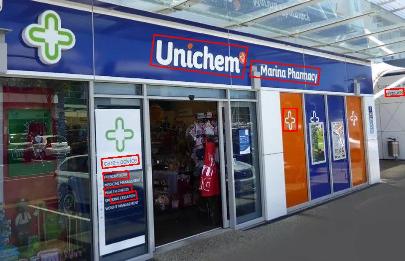
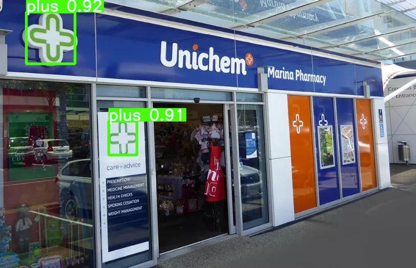

# Documentation

This file is the documentation for the system.

[TOC]

## Introduction

The system can be divided to 3 modules:

1. PaddleOCR: which aims to detect all the texts in the image
2. YOLO: aims to detect all the logos as well as its shape in the image
3. Postprocessing: using the preceding results to get the ASCII encoding of the image.

### PaddleOCR

We use the pretrained model released by Baidu to complete the OCR function of our system.

PaddleOCR is a two-stage model. Regarding OCR as text detection and text recongntion, PaddleOCR firstly use a DB to do text detection, then use a CRNN to do text recogntion.



### YOLO

YOLO is a single-stage object detection model. It can detect the location and classify the object simultaneously.

The logo/shape detection task is complished by training yolov5 on custom dataset. We trained the yolov5 model starting from the pretrained model for 100 epochs on a server with GPU for 2 hours. The best performing weights is saved at yolov5/weights/best.pt. The trained yolo model is called by torch.hub() fonction. We will use it to do shape detection in our system.



### Postprocessing

This module consists of post process the text detection and shape detection in the previous two modules. It can convert the text and shape to the corresponding ASCII characters, while preserving their relative location.

```
                  
                  
                  
      Unichemi    
  +               
                  
                  
                  
                  

```


## Architecture

The core code is implemented in logo.py. Some auxiliary functions and methods are implemented in functions.py and shapes.py. The web service code is implemented in app.py.

### logo.py

Three classes are implemented in this file.

```python
class TextEncoder:
  def get_interest_text(self, img, debug=False):
    # ...
    return text, text_shape, text_box

class ShapeEncoder:
  def get_relevant_shape(self, img, text_center, debug=True):
    # ...
    return relevant_shapes
  
class LogoEncoder:
  def encode_text(self, img, save_path):
    # ...
    return text
  
  def encode_logo(self, img, save_path):
    # ...
    return res
```

* TextEncoder
  1. call PaddleOCR to do text detection
  2. get the most import text in the image, according to the text area and its distance with respect to the image center
  3. provide API **get_interest_text()** return the text information, including its content, box and text size

* ShapeEncoder
  1. call YOLO model to perform logo/shape detection in the image
  2. according to the text location (text center) given by TextEncoder, determine the most relevant logo(s) with repect to the most important text given by TextEncoder, the algorithm select the shape with the most score which is defined as the multiplication of area, confidance and inverse distance, and include all shapes within it
  3. provide API **get_relevant_shape()** return the relevant shapes

* LogoEncoder
  1. call TextEncoder to get the most important text, then call ShapeEncoder to find the most relevant logo/shape of it
  2. Based on the bouding box of text and logo(shape), rasterize the corresponding image region according to the size of single character in the text (i.e., the pixels of each dimension it occupies)
  3. Render the region, which is now represented by a two-dimensional array of characters, with rule-based shape ASCII encoding, and the text
  4. provide two APIs: **encode_text()** which only return the text, and **encode_logo()** which return both text and shape

### app.py

The GET method and POST method is allowed.

Each time it recevies a image byte stream, it trys to convert it to a RGB image. Then call the model (LogoEncoder) to extract the ASCII encoding of the RGB image, and send it to user.

### functions.py

some auxiliary functions used by logo.py

### shapes.py

functions to draw shape in the two-dimensional array of ASCII char, used by logo.py

## Deployment

You can use docker to deploy the web service.

1. Pull the latest released image from DockerHub via

   ```
   docker pull jordane95/logo
   ```

2. Run the container locally on your own machine via

   ```
   docker run -dp 2333:7595 --name logo_server jordane95/logo
   ```

3. Use the web service on your local host with curl

   ```
   curl -X POST -F image=@your_image.jpg 'http://localhost:2333'
   ```

   Please note that you should replace your_image.jpg with your image name. Then you will receive the response in the command line which may look like as follows

   ```
      /\              
     /  \PSYANGILCOM  
    /_  _\            
   ```

## Debugging

During runing or testing, if the system doesn't perform well on some images and you want to figure out why, you can check the intermediate results saved in the docker container.

Firstly, open the doceker container in the command line via

```
docker exec -it logo_server /bin/sh
```

You can then lookup the intermediate results in the directory.

Note that 

* the ocr result produced by PaddleOCR is save at images/ocr_result.jpg

* the logo detection result given by YOLOv5 is saved at runs/hub/exp#/image0.jpg, where # is a number representing how many times you have called the model

## Future work

There are serveral improvements that can be made to improve the performance of the system.

* train the YOLO model on larger and high quality dataset for better logo detection

* improve the algorithm of rasterization and rendering

  * rasterize the whole image starting from the text region rather than staring from the origin of the background, then select the part where there is logo or text located in, to enhance the size calculation

  * distinguish the case when the text is outside the logo or inside it and design different drawing strategy for the shape to alleviate the coverage problem

* design more beautiful predefined shapes with ASCII char

* handle the unk logo with automatic ASCII art generation

